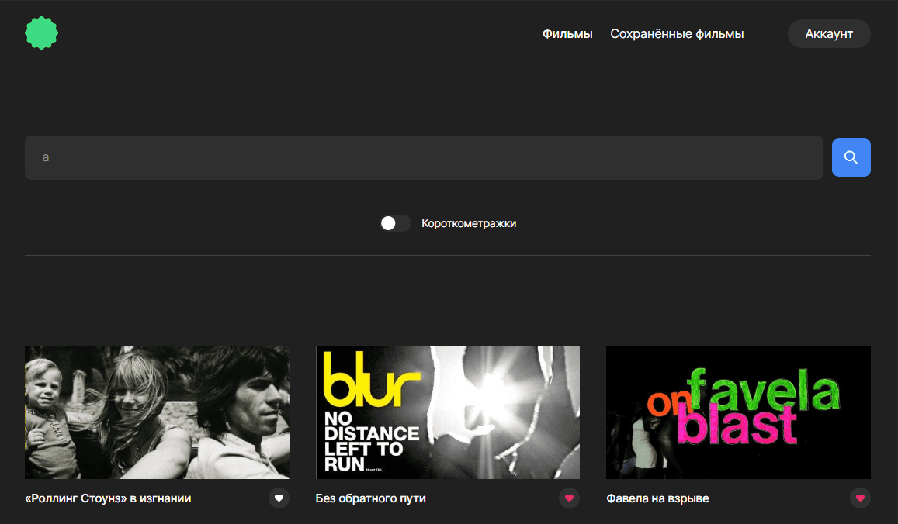
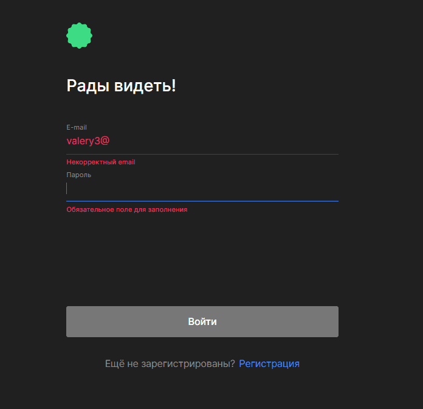

#   Frontend проекта "Movies"

---

## Описание проекта

Frontend часть дипломного проекта, в которой было 2 этапа. 1 - JSX и вёрстка, 2 - функциональность на "React" и JS. Верстка сделана в соответствии с генерируемым макетом ([перейти по ссылке](https://drive.google.com/file/d/1qc11bqlKasuEnmshIwPNf7kUcTkt53gi/view?usp=sharing 'https://drive.google.com/file/d/1qc11bqlKasuEnmshIwPNf7kUcTkt53gi/view?usp=sharing')).  Frontend часть взаимодействует с нашим сервером и сторонним сервером "BeatfilmMoviesApi". 
Реализована возможность авторизации и аутентификации пользователя. На главной странице информация о проекте, об используемых технологиях и о студенте. Она доступна не зарегистрированным пользователям. Для использования основной функциональности необходима авторизация. На странице "Фильмы" отображаются фильмы по запросу и по фильтру "короткометражные", которые приходят с сервера "BeatfilmMoviesApi". Эти фильмы можно сохранять в избранные, которые будут отображаться на странице "Сохраненные фильмы". Эта логика осуществляется с помощью нашего api ([перейти по ссылке](https://github.com/koshinva/movies-explorer-api 'https://github.com/koshinva/movies-explorer-api')). На станице "Сохраненные фильмы" также возможен поиск и фильтрация фильмов. Реализовано удаление фильма из избранных. При клике на фильм происходит переход на платформу YouTube, а именно на трейлер фильма. Также есть возможность редактировать свой профиль. 

*Скриншот страницы "Фильмы"*

---

## Используемые технологии

   

---

## Функциональность

- В качестве инфраструктуры проекта используется пакет CRA
- Для каждого компонента создана отдельная директория, в которой лежат JS и CSS-файлы компонента
- Адаптивная, кроссбраузерная, отзывчивая верстка
- Следование правилам семантической разметки HTML
- Использование при вёрстке Flex Layout и Grid Layout
- В разных частях проекта есть переиспользуемые блоки
- БЭМ методология написания классов
- С помощью пакета react-router-dom настроена маршрутизация по страницам (`/`, `/signin`, `/signup`, `movies`, `saved-movies`, `/profile`)
- Созданы асинхронные GET- и POST-запросы к API
- Созданы все запросы к нашему и стороннему API
- Роуты защищены `/saved-movies`, `/profile` и `/movies` авторизацией
- Используются глобальные state переменные с помощью `createContext`
- JWT-токен хранится в cookie
- Настроен прелоадер, который работает при обработке запросов на сервер
- Клик по фильму ведет на трейлер фильма на YouTube
- Количество отображаемых фильмов и добавляемых по кнопке "Ещё" зависит от ширины экрана
- Настроена валидация данных на стороне клиента при регистрации, логине и редактировании профиля
- Шапка проекта имеет 2 состояния в зависимости от того, зарегистрирован пользователь или нет
- Строка запроса, фильтр "короткометражки", показанные фильмы сохраняются в localstorage

*Скриншот валидации формы на странице "Войти", ширина экрана 320px*

---

## Ссылки

:point_right: **Frontend** часть размещена на виртуальной машине *Yandex Cloud*, доступна по **[ссылке](https://movies.koshinva.nomoredomains.club 'https://movies.koshinva.nomoredomains.club')**

Репозиторий проекта на **GitHub**

Репозиторий backend части на **GitHub**

Ссылка на **макет**  :point_right:  [:cloud:](https://drive.google.com/file/d/1qc11bqlKasuEnmshIwPNf7kUcTkt53gi/view?usp=sharing)

---

*Задать вопрос по проекту*
